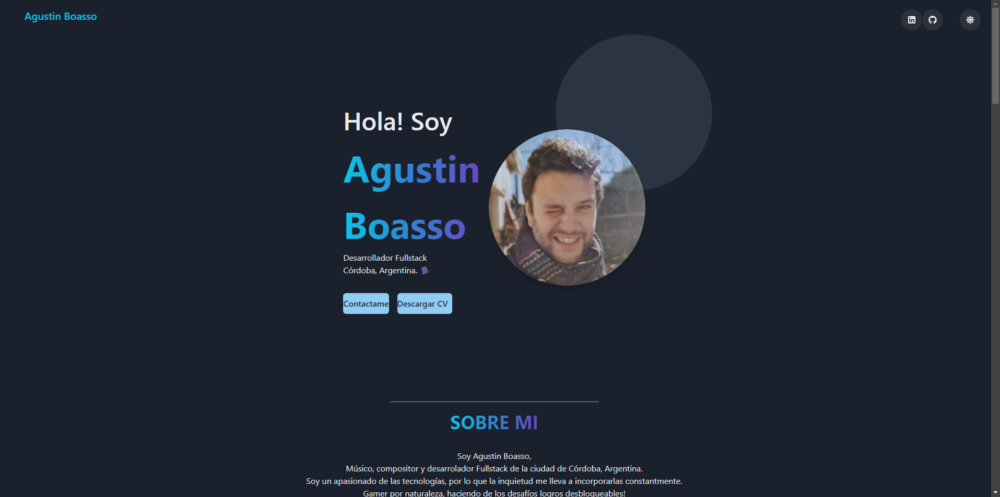

# Mi Portfolio


Este es mi portfolio personal, un diseño sencillo y elegante hecho en su mayoría con React JS utilizando el framework Chakra UI. Aproveché al máximo las características de Chakra para lograr un diseño minimalista, incluyendo el uso de `useColorMode` para los gradientes y el modo oscuro por defecto. También utilicé la librería de iconos de Chakra para representar mis habilidades tecnológicas.

El código de este proyecto es 100% de mi autoría y está disponible para su uso libre, pero agradecería que menciones la fuente si decides utilizarlo.

## Vista previa



## Tecnologías utilizadas

- React JS
- Chakra UI

## Instrucciones de instalación

1. Clona este repositorio en tu máquina local.
2. Navega hasta la carpeta del proyecto.
3. Instala las dependencias utilizando el siguiente comando:

```bash
npm install
